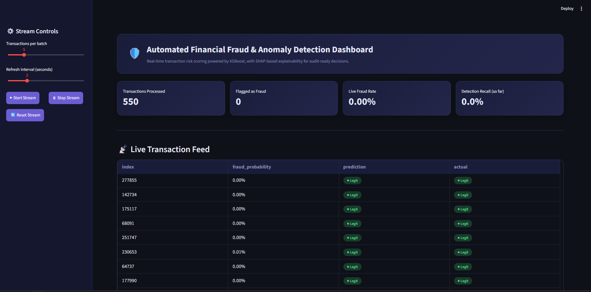
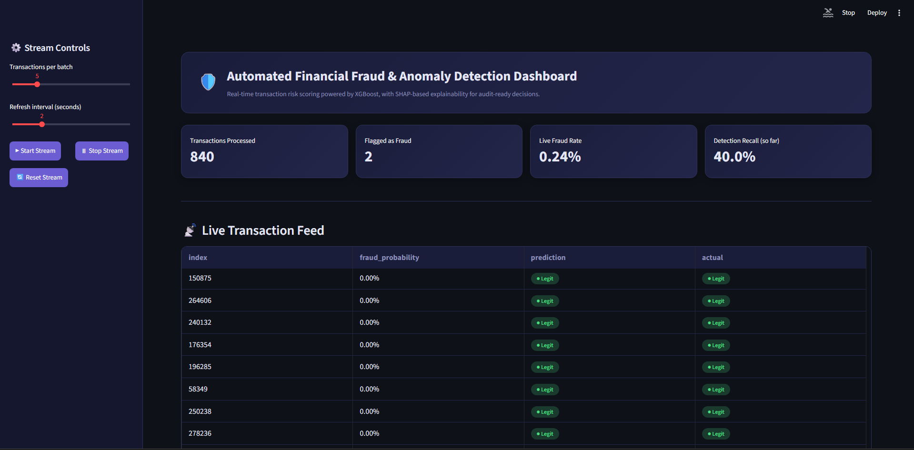
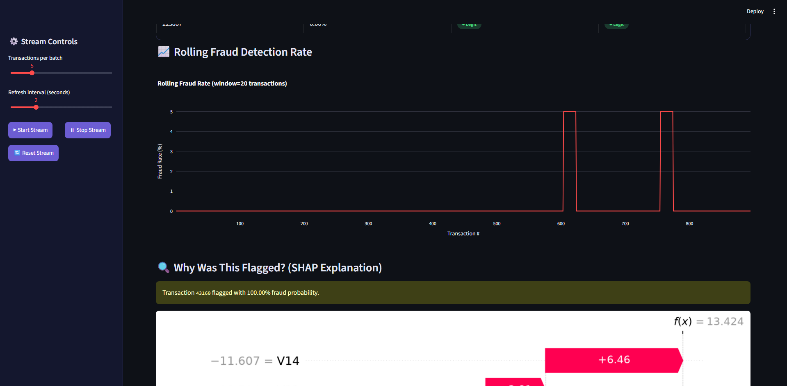
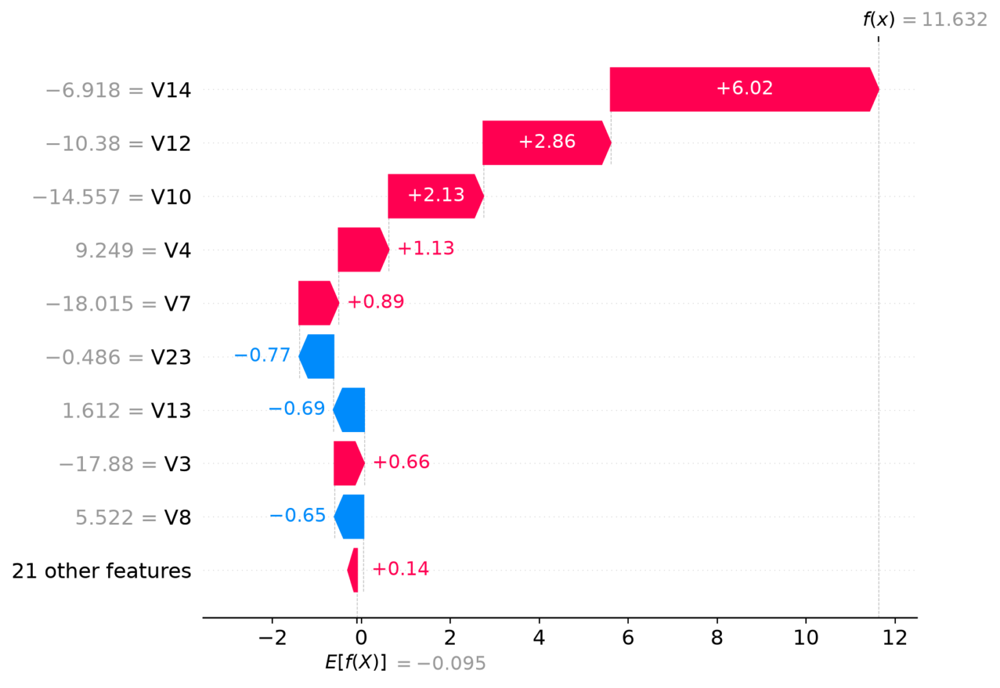
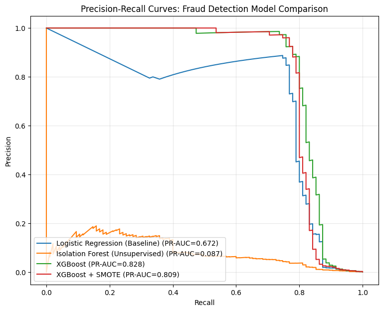
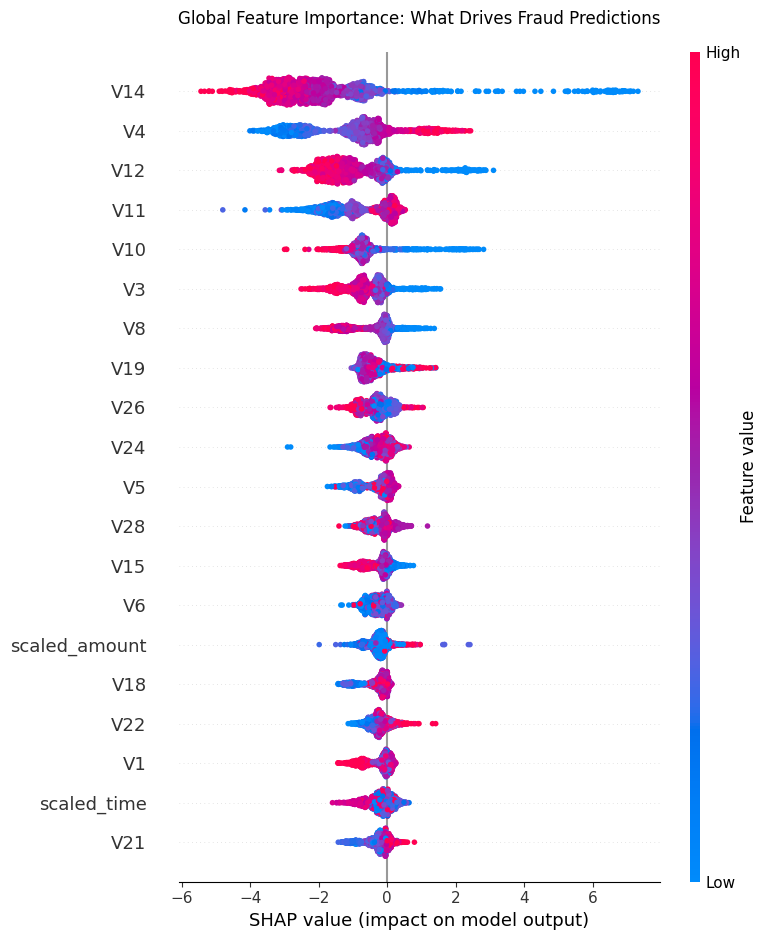

# 🛡️ Automated Financial Fraud & Anomaly Detection Pipeline


---

# 📖 Project Overview

This project is an end-to-end **MLOps pipeline** for detecting fraudulent financial transactions in real time combining machine learning, explainable AI, and automated deployment into a live, interactive risk-monitoring dashboard. This project simulates a production-grade fraud detection system used by financial institutions to flag suspicious transactions in real time, while providing **explainable, audit-ready reasoning** behind every decision a critical requirement in risk management and regulatory compliance contexts.

The pipeline covers the full lifecycle: data engineering → model training → explainability → live dashboard → containerization → automated CI/CD.

This project includes:

- 🔍 Class Imbalance Handling (SMOTE vs. Class Weights)
- 🤖 Multi-Model Comparison (Logistic Regression, Isolation Forest, XGBoost)
- 🧠 SHAP Explainability (global + per-transaction)
- 📡 Real-Time Streamlit Dashboard
- 🐳 Docker Containerization
- ⚙️ GitHub Actions CI/CD Automation

---

## 📂 Dataset

| Feature | Details |
|---------|---------|
| Source | [Kaggle Credit Card Fraud Detection](https://www.kaggle.com/mlg-ulb/creditcardfraud) |
| Records | 284,807 transactions |
| Fraud Cases | 492 (0.17% fraud rate) |
| Features | V1–V28 (PCA-transformed), Time, Amount |
| Class Balance | Extremely imbalanced |

The dataset was cleaned, deduplicated, and scaled before modeling.

---

## 🛠 Tech Stack

| Tool | Purpose |
|------|----------|
| 🐍 Python | Programming |
| 🐼 Pandas / NumPy | Data Engineering |
| ⚖️ imbalanced-learn | SMOTE / Imbalance Handling |
| 🌲 Scikit-learn | Logistic Regression, Isolation Forest |
| 🚀 XGBoost | Champion Fraud Detection Model |
| 🧠 SHAP | Model Explainability |
| 📊 Matplotlib / Plotly | Visualization |
| 🖥️ Streamlit | Real-Time Dashboard |
| 🐳 Docker | Containerization |
| ⚙️ GitHub Actions | CI/CD Automation |
| ☁️ Google Colab | Model Training Environment |

---

## 📸 Dashboard Preview

### 🛡️ Live Dashboard Overview



### 📡 Live Transaction Feed



### 📈 Rolling Fraud Detection Rate



### 🔍 SHAP Explanation Panel

 

Each flagged transaction gets a live SHAP waterfall breakdown showing exactly which features pushed the model toward a fraud prediction critical for audit-ready, regulator-facing decisions in a real risk-management context.

---

## 🤖 Model Comparison



| Model | PR-AUC | ROC-AUC |
|---|---|---|
| **XGBoost (Champion)** | **0.828** | **0.974** |
| XGBoost + SMOTE | 0.809 | 0.973 |
| Logistic Regression (Baseline) | 0.672 | 0.966 |
| Isolation Forest (Unsupervised) | 0.087 | 0.940 |

**Precision-Recall AUC** was used as the primary metric instead of accuracy or plain ROC-AUC at a 0.17% fraud rate, a model predicting "no fraud" for every transaction would score 99.8% accuracy while catching zero fraud.

**Key finding:** XGBoost with native class weighting (`scale_pos_weight`) outperformed XGBoost + SMOTE synthetic oversampling slightly diluted the decision boundary compared to XGBoost's built-in weighting. This was tested empirically, not assumed.

Isolation Forest's low PR-AUC is expected by design its value isn't beating supervised models, it's providing a label-free detection layer capable of catching **novel** fraud patterns a historically-trained model has never seen.

---

## 🧠 Global Feature Importance



Top predictive features by mean absolute SHAP value: **V14, V4, V12, V11, V10**

---

## 📌 Key Findings

- XGBoost with class weighting outperformed SMOTE-based resampling on this dataset.
- Precision-Recall AUC was essential standard accuracy would have been meaningless given the 0.17% fraud rate.
- SHAP explainability revealed a small set of anonymized PCA components (V14, V4, V12) drive most fraud predictions.
- A genuine false negative was found during live streaming testing: transaction `58761` was actual fraud, but the model predicted only a **0.01%** fraud probability a confident miss. This shows some fraud cases closely resemble legitimate transactions in PCA-transformed feature space, a real limitation worth documenting rather than hiding.
- Isolation Forest, despite lower PR-AUC, adds genuine value as an unsupervised, label-free detection layer for novel fraud patterns.

---

## 💡 Recommendations

- In production, the risk threshold (currently 0.5 in the dashboard) should be tuned against a real cost matrix the cost of missing fraud (false negative) is typically far higher than a false alarm (false positive).
- SHAP-based explanations should be included in any regulator- or auditor-facing fraud system, not just as a nice-to-have.
- Isolation Forest or similar unsupervised methods should run alongside supervised models in production, since fraud patterns evolve and labeled training data always lags behind new fraud tactics.

---

## 📂 Repository Structure

```text
fraud-detection-pipeline/
├── .github/workflows/     # CI/CD pipeline (ci-cd.yml)
├── .streamlit/             # Dashboard theme config
├── artifacts/               # Trained model, scaler, SHAP explainer, evaluation outputs
│   ├── champion_model.pkl
│   ├── scaler.pkl
│   ├── shap_explainer.pkl
│   ├── X_test.pkl / y_test.pkl
│   ├── X_train.pkl / y_train.pkl
│   └── model_comparison.csv
├── dashboard/
│   └── app.py               # Streamlit real-time dashboard
├── data/
│   └── creditcard.csv.zip   # Compressed dataset
│   
├── images/                  # Screenshots used in this README
├── notebooks/
│   └── Automated_Financial_Fraud.ipynb   # Full training & evaluation notebook
├── Dockerfile
├── .dockerignore
├── requirements.txt
└── README.md
```

---

# 🚀 How to Run the Project

1. Clone this repository.

```bash
git clone https://github.com/kazimalizaidi/fraud-detection-pipeline.git
cd fraud-detection-pipeline
```

2. Unzip the dataset.

```bash
# unzip data/creditcard.csv.zip into data/creditcard.csv
```

3. Install the required libraries.

```bash
pip install -r requirements.txt
```

4. Run the dashboard locally.

```bash
python -m streamlit run dashboard/app.py
```

5. Or run it fully containerized with Docker.

```bash
docker build -t fraud-detection-dashboard .
docker run -p 8501:8501 fraud-detection-dashboard
```

6. Open the training/evaluation notebook in `notebooks/` (Google Colab recommended) to reproduce the full model pipeline from scratch.

---

## ⚙️ CI/CD Pipeline

Every push to `main` automatically triggers:

1. **`validate`** installs pinned dependencies, checks the dashboard compiles cleanly, confirms all model artifacts exist
2. **`docker-build`** builds the Docker image from a clean environment to catch integration issues before they reach production

See [`.github/workflows/ci-cd.yml`](.github/workflows/ci-cd.yml).

---

# 📌 Future Improvements

Potential enhancements include:

- Manual transaction entry form alongside the live stream simulation
- Cost-sensitive threshold tuning based on a real fraud-cost matrix
- Live data ingestion via Kafka or a message queue instead of a simulated stream
- Model monitoring for data/concept drift over time
- Deployment to Streamlit Community Cloud or Hugging Face Spaces for a public live demo link
- A/B comparison of newer boosting frameworks (LightGBM, CatBoost) against the current XGBoost champion

---

# 📚 References & Data Sources

- **Dataset:** [Kaggle — Credit Card Fraud Detection](https://www.kaggle.com/mlg-ulb/creditcardfraud) (ULB Machine Learning Group)

---

# 🎧 Project Soundtrack

*This track was on loop while working on this project*

[Stargazing - Marcelo De Carvalho](https://open.spotify.com/track/7A0VclPXLv4lNsrUpyaz8Z?si=a15803bbfe1e47c5)

**Star this repository if you found it interesting!** ⭐

made with ❤️ by **kazim**
